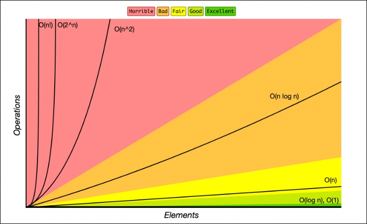

# Big O Notation

**Source:**
**MOC:** [01_System/MOC - Complexity](../01_System/MOC%20-%20Complexity.md)

## Definition

Big O is a mathematical notation that describes the **limiting behavior** of a function as the argument tends towards infinity. In computer science, it is the standard language used to describe the **Scalability** of an algorithm.

## The 3 Pillars of Programming

Good code is measured by three criteria:

1. **Readable:** Is it easy for other humans to understand?
2. **Scalable (Time):** Does it run efficiently as input grows?
3. **Scalable (Memory):** Does it use resources efficiently?

> [!IMPORTANT] > **Premature Optimization:** "Premature optimization is the root of all evil." If your input is small and fixed, readability usually trumps complexity optimization.

## Why it Matters

We don't measure performance in seconds (which depends on hardware), but in the **number of operations** relative to the input size ($n$).

### Core Efficiency Classes

- **Excellent:** $O(1)$ and $O(\log n)$
- **Fair:** $O(n)$
- **Bad:** $O(n \log n)$
- **Horrible:** $O(n^2)$ and $O(2^n)$

---

**Links:** [[Big O - Time Complexity Classes]] | [[Space Complexity]]
